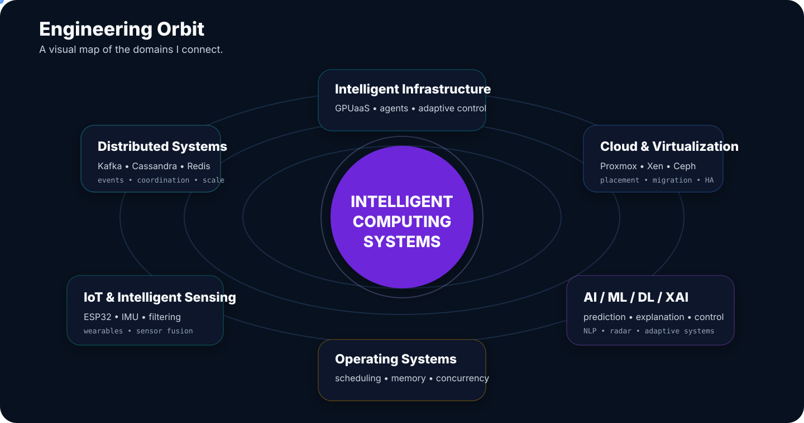
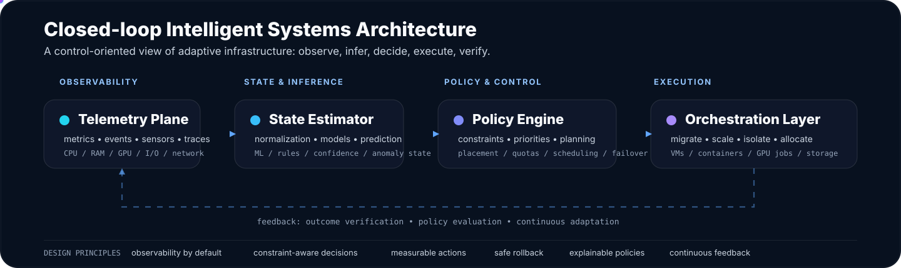
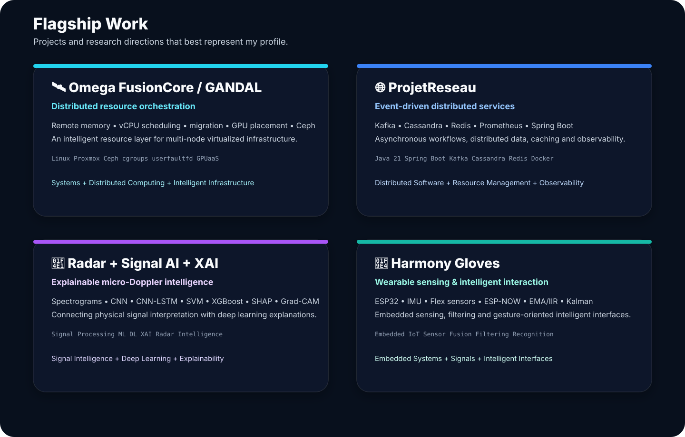

<div align="center">



<br/><br/>


</div>

## `About`

I am **Savio Tsafack (@Savhel)**, a computer engineering student focused on **distributed systems, systems engineering, intelligent infrastructure and artificial intelligence**.

I am interested in computing systems that can **observe their environment, model state, make decisions, allocate resources, adapt and scale**.

---



---



---



---


---

## `Core direction`

```yaml
distributed_systems:
  - event-driven architectures
  - distributed data
  - resource scheduling
  - cluster orchestration
  - distributed storage

systems:
  - operating systems
  - scheduling
  - concurrency
  - memory management
  - virtualization
  - performance control

intelligent_systems:
  - AI / ML / Deep Learning
  - Explainable AI
  - expert & multi-agent systems
  - intelligent infrastructure
  - autonomous orchestration

applied_research:
  - radar micro-Doppler classification
  - signal processing
  - wearable sensing
  - GPU-as-a-Service
```

## `Selected repositories`

| Project | Focus |
|---|---|
| 🛰️ [Omega_FusionCore_Proxmox](https://github.com/Savhel/Omega_FusionCore_Proxmox) | Distributed resource management, virtualization, Ceph, scheduling, migration, GPUaaS |
| 🌐 [ProjetReseau](https://github.com/Savhel/ProjetReseau) | Kafka, Cassandra, Redis, event-driven resource services |
| 🧵 [simulation_capteurs](https://github.com/Savhel/simulation_capteurs) | Concurrency, synchronization, queues, dynamic scheduling |
| ⚙️ [SimulationDePlanificationDesProcessus](https://github.com/Savhel/SimulationDePlanificationDesProcessus) | Process scheduling and operating-systems concepts |
| 🧠 [AnalyseDesSentiments](https://github.com/Savhel/AnalyseDesSentiments) | NLP / Machine Learning workspace |
| 📡 [Traitement-du-signal](https://github.com/Savhel/Traitement-du-signal) | Signal-processing workspace |
| 🔐 [alanya_app](https://github.com/Savhel/alanya_app) | Secure real-time communication |

## `Technology stack`

<div align="center">


<br/>


</div>

## `GitHub signal`

<div align="center">


</div>

<div align="center">
  
</div>

---

<div align="center">

### `DISTRIBUTED SYSTEMS • SYSTEMS • AI • ML • DL • XAI • INTELLIGENT INFRASTRUCTURE`

<sub>Observe. Model. Decide. Act. Adapt.</sub>

</div>
