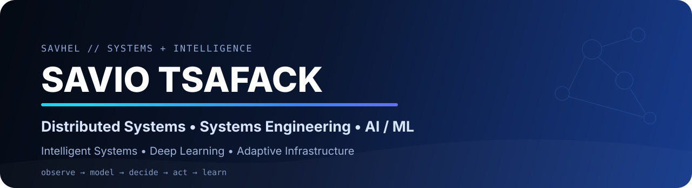

<div align="center">



<br/>


</div>

## `00 // IDENTITY`

```yaml
name: Savio Tsafack
github: "@Savhel"

profile:
  - Distributed Systems
  - Systems Engineering
  - Operating Systems
  - Intelligent Systems
  - Artificial Intelligence
  - Machine Learning
  - Deep Learning

current_interests:
  - dynamic resource scheduling
  - virtualization & datacenter systems
  - distributed memory / compute
  - intelligent orchestration
  - ML-driven decision systems
  - signal processing & AI
```

I am an engineering student focused on the intersection of **systems, distributed computing and artificial intelligence**.

I am especially interested in systems that **observe their environment, make decisions and adapt dynamically**: schedulers, resource managers, cluster controllers, intelligent agents, distributed runtimes and ML-powered services.

---

## `01 // CORE FOCUS`

<table>
<tr>
<td width="33%" valign="top">

### 🧠 AI / ML

- Machine Learning
- Deep Learning
- Intelligent Systems
- Recommendation Systems
- NLP / Sentiment Analysis
- AI-assisted decision systems

</td>
<td width="33%" valign="top">

### 🌐 Distributed Systems

- Event-driven architectures
- Distributed resource management
- Cluster orchestration
- Remote memory concepts
- Distributed databases
- Fault-aware system design

</td>
<td width="33%" valign="top">

### ⚙️ Systems

- Operating Systems
- Virtualization
- Scheduling
- Concurrency
- CPU / RAM / GPU management
- Datacenter engineering

</td>
</tr>
</table>

---

## `02 // SYSTEMS LAB`

### 🛰️ [Omega FusionCore / Proxmox](https://github.com/Savhel/Omega_FusionCore_Proxmox)

**Distributed resource orchestration for a Proxmox cluster**

A systems project exploring dynamic resource management across a multi-node virtualization cluster.

**Current engineering themes include:**

- remote memory paging between cluster nodes;
- elastic vCPU scheduling;
- live migration under resource pressure;
- cluster-wide placement and rebalancing;
- GPU application proxying and placement;
- local I/O scheduling with cgroup metrics and pressure signals;
- shared storage through Ceph RBD.

`Proxmox` `Linux` `Ceph` `cgroups v2` `userfaultfd` `Python` `Virtualization`

> This is the project that best represents my systems / distributed-systems direction.

---

### 🌐 [ProjetReseau](https://github.com/Savhel/ProjetReseau)

**Event-driven resource management service**

A backend platform built around asynchronous processing and distributed infrastructure components.

`Java 21` `Spring Boot` `Kafka` `Cassandra` `Redis` `Prometheus` `Docker`

Focus: event-driven architecture, caching, observability, state transitions and resource-management services.

---

### 🧵 [Simulation de capteurs concurrents](https://github.com/Savhel/simulation_capteurs)

A concurrent C++ simulation with multiple producers, a synchronized server, bounded/dynamic queues and switchable scheduling policies.

`C++20` `Threads` `Mutex` `Condition Variables` `Scheduling`

Focus: concurrency, synchronization, queueing behavior and dynamic scheduling policies.

---

### ⚙️ [Simulation de planification des processus](https://github.com/Savhel/SimulationDePlanificationDesProcessus)

A systems-oriented project exploring process scheduling and operating-system resource-management concepts.

`C++` `Operating Systems` `Scheduling`

---

## `03 // AI & INTELLIGENT SYSTEMS`

My AI direction is centered on **using learning and reasoning to improve system behavior**, not only on training isolated models.

Areas I am developing and consolidating:

```text
Data / Signals
      │
      ▼
Representation
      │
      ├── Classical ML
      ├── Deep Learning
      ├── NLP
      └── Signal Processing
      │
      ▼
Prediction / Decision
      │
      ▼
Intelligent System
      │
      ├── Recommendation
      ├── Classification
      ├── Detection
      ├── Resource Scheduling
      └── Adaptive Control
```

### Repositories / workspaces to strengthen publicly

- [`AnalyseDesSentiments`](https://github.com/Savhel/AnalyseDesSentiments) — AI/NLP workspace; currently needs public documentation.
- [`Traitement-du-signal`](https://github.com/Savhel/Traitement-du-signal) — signal-processing workspace; currently needs public documentation.
- AI/ML work also appears in collaborative and organization repositories, but this profile only presents projects as personal flagships when the public repository clearly documents my own work.

---

## `04 // ENGINEERING MAP`

| Domain | Technologies / concepts |
|---|---|
| **Systems** | Linux, process scheduling, concurrency, cgroups, virtualization |
| **Distributed systems** | Kafka, Cassandra, Redis, Ceph, multi-node orchestration |
| **Backend** | Java, Spring Boot, Spring WebFlux, REST APIs |
| **AI / ML** | Python, ML pipelines, NLP, recommendation, intelligent decision systems |
| **Data & signals** | signal processing, data preparation, metrics |
| **Infrastructure** | Proxmox, Docker, monitoring, resource control |
| **Security** | JWT, API keys, encryption, secure service design |

---

## `05 // TOOLBOX`

<div align="center">

### Languages


### Systems / Backend / Data


<br/>


</div>

---

## `06 // HOW I APPROACH INTELLIGENT SYSTEMS`

```text
Observe
  │
  ▼
Measure ─────► Model
  │             │
  │             ▼
  │          Predict
  │             │
  ▼             ▼
Policy ─────► Decide
  │
  ▼
Act
  │
  ▼
Evaluate ─────► Learn / Adapt
```

I am interested in combining **systems engineering** and **AI** to create software that can:

- monitor its own state;
- detect pressure or anomalies;
- predict future behavior;
- choose a policy;
- reallocate resources;
- adapt from feedback.

That is the direction connecting my work in **distributed systems, schedulers, virtualization, signal processing, ML and intelligent systems**.

---

## `07 // SELECTED PROJECTS`

<table>
<tr>
<td width="50%" valign="top">

### 🛰️ Omega FusionCore

Distributed resource scheduling and orchestration for Proxmox clusters.

**Themes:** RAM, vCPU, GPU, migration, Ceph, cgroups.

[Repository →](https://github.com/Savhel/Omega_FusionCore_Proxmox)

</td>
<td width="50%" valign="top">

### 🌐 ProjetReseau

Event-driven resource-management backend.

**Themes:** Kafka, Cassandra, Redis, Prometheus, Spring Boot.

[Repository →](https://github.com/Savhel/ProjetReseau)

</td>
</tr>

<tr>
<td width="50%" valign="top">

### 🧵 Concurrent Sensors

C++ concurrent simulation with dynamic scheduling policies.

**Themes:** threads, synchronization, queues, scheduling.

[Repository →](https://github.com/Savhel/simulation_capteurs)

</td>
<td width="50%" valign="top">

### 🧠 AI / Intelligent Systems

ML, NLP, signal processing and adaptive-system workspaces.

**Themes:** ML, Deep Learning, NLP, signals, intelligent decision systems.

[Repositories →](https://github.com/Savhel?tab=repositories)

</td>
</tr>
</table>

---

## `08 // GITHUB`

<div align="center">


</div>

> Repository-language statistics reflect public code distribution, not skill level.

---

## `09 // CURRENT DIRECTION`

```text
Distributed Systems  ─┐
Operating Systems     ├──► Intelligent Infrastructure
Virtualization        │
AI / ML / DL         ─┤
Signal Processing    ─┘
```

My long-term direction is to work on **intelligent, distributed and high-performance systems** where resource management, infrastructure and AI are designed together.

---

<div align="center">

### `DISTRIBUTED SYSTEMS • SYSTEMS ENGINEERING • AI • ML • DEEP LEARNING`

<sub>Build systems that can observe, decide, adapt and scale.</sub>

</div>
