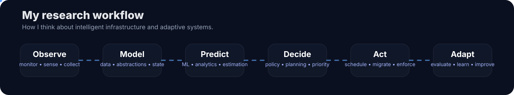

<div align="center">


<br/><br/>


</div>

# Hi, I'm Savio Tsafack (@Savhel)

I work at the intersection of **distributed systems, systems engineering, intelligent infrastructure and artificial intelligence**.

My main interest is building systems that can **observe, model, decide, act and adapt** under real-world constraints.

---


---



---


---


---

## `Quick snapshot`

```yaml
core_domains:
  - Distributed Systems
  - Systems Engineering
  - Operating Systems
  - Virtualization & Cloud Infrastructure
  - Intelligent Systems
  - AI / ML / Deep Learning
  - XAI
  - Signal & Radar Intelligence
  - IoT / Embedded Sensing
  - Expert & Multi-Agent Systems

long_term_goal:
  build systems that can observe, reason, decide, adapt and scale
```

## `Selected public repositories`

- 🛰️ **[Omega_FusionCore_Proxmox](https://github.com/Savhel/Omega_FusionCore_Proxmox)** — distributed resource management, virtualization, Ceph, scheduling, migration, GPUaaS.
- 🌐 **[ProjetReseau](https://github.com/Savhel/ProjetReseau)** — event-driven distributed services with Kafka, Cassandra, Redis and monitoring.
- 🧵 **[simulation_capteurs](https://github.com/Savhel/simulation_capteurs)** — concurrent simulation, queues, scheduling policies and synchronization.
- ⚙️ **[SimulationDePlanificationDesProcessus](https://github.com/Savhel/SimulationDePlanificationDesProcessus)** — process scheduling and operating-system concepts.
- 📡 **[Traitement-du-signal](https://github.com/Savhel/Traitement-du-signal)** — signal-processing workspace.
- 🧠 **[AnalyseDesSentiments](https://github.com/Savhel/AnalyseDesSentiments)** — NLP / ML workspace.
- 🔐 **[alanya_app](https://github.com/Savhel/alanya_app)** — secure real-time communication.

## `GitHub signal`

<div align="center">
  
  
</div>

<div align="center">
  
</div>

## `Technology map`

<div align="center">


<br/>


</div>

---

<div align="center">

### `DISTRIBUTED SYSTEMS • SYSTEMS • AI • ML • DL • XAI • INTELLIGENT INFRASTRUCTURE`

<sub>Observe. Model. Decide. Act. Adapt.</sub>

</div>
